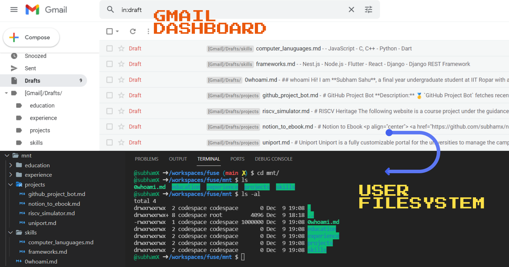
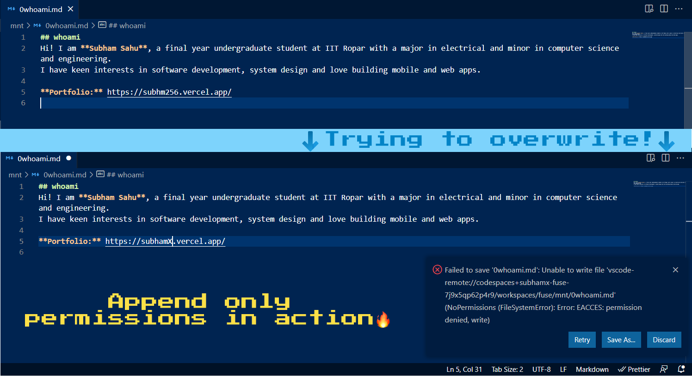

# GmailStorejFS

**GmailStorejFS** is a user filesystem built using FUSE(Filesystem in USErspace) interface to **mount Gmail mailbox locally** and use it as a **disk storage**. This project was built as part of the Operating Systems course during the Autumn Semester 2021-22.

## Key Features

1. **✨ Supports full-duplex synchronization:** Any updates performed via the mailbox dashboard and any other third party client will be reflected immediately on the following query except in some cases. Similarly, all local updates are synced instantly with the server.
2. **⚡ Blazing performance:** Includes an intelligent caching system to service user requests at higher throughput.
3. **📘 Organization by directories:** Directories up to one level and supported to keep the files organized.
4. **🔥 Includes quoted-printable parser** to handle very long text files.
5. **🚀 Supports append-only permission per file basis:** Contents inside files starting with any numerals can only be appended and cannot be deleted.

## Project Snapshots







## Compile

Please ensure that `uuid`, `libcurl`, and `libfuse` installed on the local machine.

More information on libfuse can be found [here](https://libfuse.github.io/doxygen/), and about libcurl can be found [here](https://curl.se/libcurl/c/).


Inside the `src/` directory run the following command to generate an executable! Ensure that **curl**, **uuid** and **fuse** are linked.

```bash
gcc -Wall main.c -lcurl -luuid `pkg-config fuse3 --cflags --libs`
```

## Executing

```bash
./a.out "MOUNT_DIR_PATH" --hostname="imaps://imap.gmail.com" \
--port="993" --email="EMAIL" --password='PASSWORD' -s
```

## Additional Info

* The project currently supports only text files.
* Ensure that there are no trailing slash in hostname.
* Any attempt to create a directory beyond one level will lead to Permission Error!
* Any attempt to overwrite or delete a file with a name starting from numerals will lead to Permission Error!
* Please note that renaming email subjects (filenames) and labels (directory names) in the mails from Gmail Console or any other mail client will reflect on the filesystem till the cache entries are invalidated. All other operations like mkdir, creating new files etc will be immediately synced.

## References
* IMAP RFC: https://datatracker.ietf.org/doc/html/rfc3501
* Libfuse docs: https://libfuse.github.io/doxygen/index.html
* Libcurl docs: https://curl.se/libcurl/c/
* IMAP Extensions: https://developers.google.com/gmail/imap/imap-extensions
* Quoted printable parser: https://www.w3.org/Tools/Mail-Transcode/mail-transcode.c
* Editing a draft isn't possible with IMAP: [Link](https://stackoverflow.com/questions/16945041/imap-editing-a-draft-or-existing-message#:~:text=There%20are%20no%20IMAP%20commands,to%20existing%20messages%20\(%20STORE%20\).&text=Indeed%2C%20the%20specification%20guarantees%20that,with%20a%20UID\)%20is%20immutable)
* File stats cannot be set with `readdir`: https://github.com/billziss-gh/winfsp/issues/44
* Why we are not reporting size of file contents in `getattr`: [Link](https://stackoverflow.com/questions/46267972/fuse-avoid-calculating-size-in-getattr)
* Issue with clean unmount programmatically: https://github.com/billziss-gh/cgofuse/issues/6

